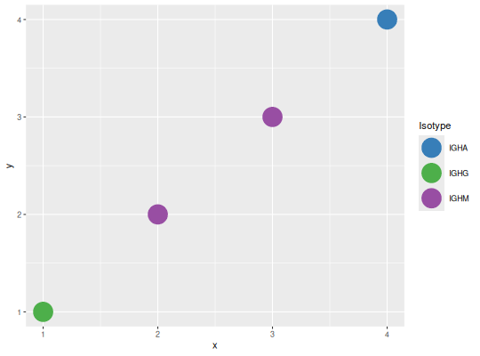
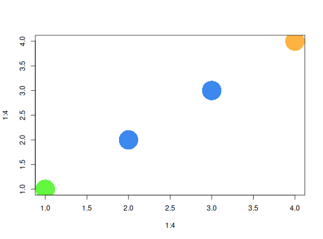

**DEFAULT_COLORS** - *Default colors*

Description
--------------------

Default color palettes for DNA characters, Ig isotypes, and TCR chains.

Usage
--------------------

```
DNA_COLORS
```
```
IG_COLORS
```
```
TR_COLORS
```


Format
-------------------
Named character vectors with hexcode colors as values.

+ `DNA_COLORS`:  DNA character colors 
`c("A", "C", "G", "T")`.
+ `IG_COLORS`:   Ig isotype colors 
`c("IgA", "IgD", "IgE", "IgG", "IgM", "IgK", "IgL")`.
+ `TR_COLORS`:   TCR chain colors 
`c("TRA", "TRB", "TRD", "TRG")`.


Examples
-------------------

```R
# IG_COLORS as an isotype color set for ggplot
isotype <- c("IgG", "IgM", "IgM", "IgA")
df <- data.frame(x=1:4, y=1:4, iso=isotype)
g1 <- ggplot(df, aes(x=x, y=y, color=iso)) + 
scale_color_manual(name="Isotype", values=IG_COLORS) +
geom_point(size=10)
plot(g1)

```



```R

# DNA_COLORS to translate nucleotide values to a vector of colors 
# for use in base graphics plots
seq <- c("A", "T", "T", "C")
colors <- translateStrings(seq, setNames(names(DNA_COLORS), DNA_COLORS))
plot(1:4, 1:4, col=colors, pch=16, cex=6)
```




