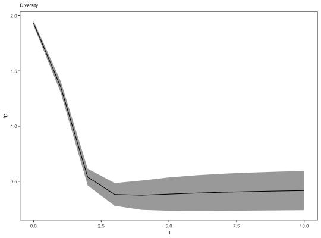

**betaDiversity** - *Calculates the pairwise beta diversity*

Description
--------------------

`betaDiversity` takes in a data.frame or [AbundanceCurve](AbundanceCurve-class.md) and computes 
the multiplicative beta diversity across a range of Hill diversity indices.


Usage
--------------------
```
betaDiversity(data, comparisons, min_q = 0, max_q = 4, step_q = 0.1,
ci = 0.95, ...)
```

Arguments
-------------------

data
:   data.frame with Change-O style columns containing clonal assignments or
an [AbundanceCurve](AbundanceCurve-class.md) object generate by [estimateAbundance](estimateAbundance.md).
containing a previously calculated bootstrap distributions of clonal abundance.

comparisons
:   named list of comparisons between group members for computing beta diversity.

min_q
:   minimum value of <code class = 'eq'>q</code>.

max_q
:   maximum value of <code class = 'eq'>q</code>.

step_q
:   value by which to increment <code class = 'eq'>q</code>.

ci
:   confidence interval to calculate; the value must be between 0 and 1.

...
:   additional arguments to pass to [estimateAbundance](estimateAbundance.md). Additional arguments
are ignored if a [AbundanceCurve](AbundanceCurve-class.md) is provided as input.


Value
-------------------

A [DiversityCurve](DiversityCurve-class.md) object summarizing the diversity scores.


Details
-------------------

Beta diversity or the comparative difference between two samples as quantified using Hill
diversity indices proposed by Jost (Jost, 2007). 

Briefly, the alpha and gamma diversity components are calculated for each comparison. 
Alpha diversity is calculated as the average hill diversity across each independent sample
while Gamma diversity is calculated as the total diversity without distinguishing between
samples. Beta diversity is computed as Gamma/Alpha. 

Diversity is calculated on the estimated clonal abundance distribution with a correction
for unseen species much like the calculation for alpha diversity [alphaDiversity](alphaDiversity.md).
A smooth curve is generated in the same manner as in [alphaDiversity](alphaDiversity.md).
Confidence intervals are derived using the standard deviation of the resampling realizations. 


1. Hill M. Diversity and evenness: a unifying notation and its consequences. 
Ecology. 1973 54(2):427-32.
1. Jost L. Partitioning Diversity Into Independent Alpha and Beta Components. 
Ecology. 2007 88(10):2427–2439.
1. Jost L, et al. Partitioning diversity for conservation analyses. 
Diversity Distrib. 2010 16(1):65–76


Examples
-------------------

```R
div <- betaDiversity(ExampleDb, comparisons=list("TIME"=c("-1h", "+7d")), group="SAMPLE", 
min_n=40, step_q=1, max_q=10, nboot=100)

plotDiversityCurve(div, legend_title="Isotype")
```




