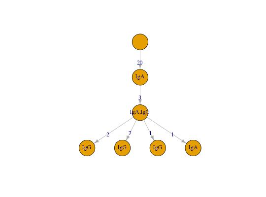
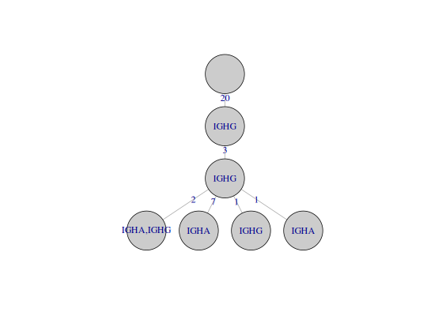

**permuteLabels** - *Permute the node labels of a tree*

Description
--------------------

`permuteLabels` permutes the node annotations of a lineage tree.


Usage
--------------------
```
permuteLabels(graph, field, exclude = c("Germline", NA))
```

Arguments
-------------------

graph
:   igraph object containing an annotated lineage tree.

field
:   string defining the annotation field to permute.

exclude
:   vector of strings defining `field` values to exclude 
from permutation.


Value
-------------------

A modified igraph object with vertex annotations permuted.


Examples
-------------------

```R
# Define and plot example graph
library(igraph)
graph <- ExampleTrees[[23]]
plot(graph, layout=layout_as_tree, vertex.label=V(graph)$c_call, 
vertex.size=50, edge.arrow.mode=0, vertex.color="grey80")

```



```R

# Permute annotations and plot new tree
g <- permuteLabels(graph, "c_call")
plot(g, layout=layout_as_tree, vertex.label=V(g)$c_call,
vertex.size=50, edge.arrow.mode=0, vertex.color="grey80")

```




See also
-------------------

[testEdges](testEdges.md).


