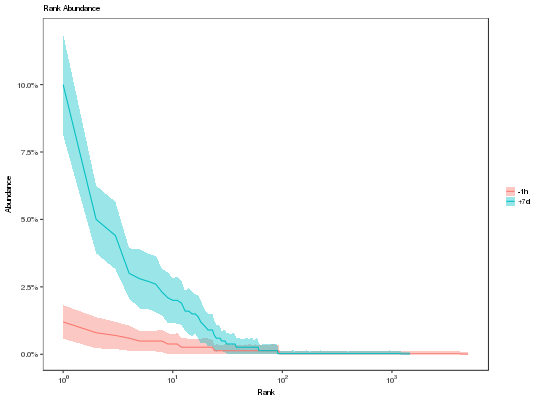

**plotAbundance** - *Plots a clonal abundance distribution*

Description
--------------------

`plotAbundance` plots the results from estimating the complete clonal relative 
abundance distribution. The distribution is plotted as a log rank abundance 
distribution.


Usage
--------------------
```
plotAbundance(data, colors = NULL, main_title = "Rank Abundance",
legend_title = NULL, xlim = NULL, ylim = NULL, silent = FALSE, ...)
```

Arguments
-------------------

data
:   data.frame returned by [estimateAbundance](estimateAbundance.md).

colors
:   named character vector whose names are values in the 
`group` column of `data` and whose values are 
colors to assign to those group names.

main_title
:   string specifying the plot title.

legend_title
:   string specifying the legend title.

xlim
:   numeric vector of two values specifying the 
`c(lower, upper)` x-axis limits.

ylim
:   numeric vector of two values specifying the 
`c(lower, upper)` y-axis limits.

silent
:   if `TRUE` do not draw the plot and just return the ggplot2 
object; if `FALSE` draw the plot.

...
:   additional arguments to pass to ggplot2::theme.


Value
-------------------

A `ggplot` object defining the plot.


Examples
-------------------

```R
# Estimate abundance by sample and plot
abund <- estimateAbundance(ExampleDb, "SAMPLE", nboot=100)
plotAbundance(abund)
```




See also
-------------------

See [estimateAbundance](estimateAbundance.md) for generating the input abundance distribution.
Plotting is performed with [ggplot](http://www.rdocumentation.org/packages/ggplot2/topics/ggplot).


