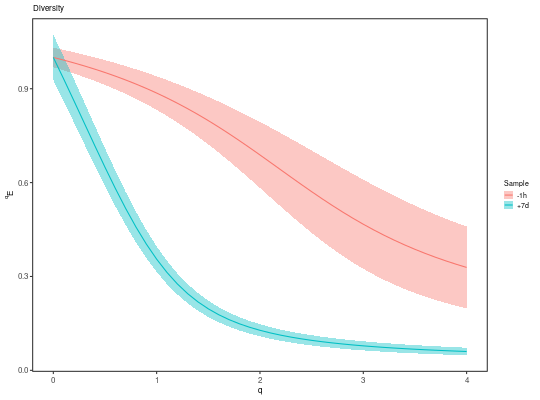

**plotDiversityCurve** - *Plot the results of rarefyDiversity*

Description
--------------------

`plotDiversityCurve` plots a `DiversityCurve` object.


Usage
--------------------
```
plotDiversityCurve(data, colors = NULL, main_title = "Diversity",
legend_title = "Group", log_q = TRUE, log_d = TRUE, xlim = NULL,
ylim = NULL, annotate = c("none", "depth"), silent = FALSE, ...)
```

Arguments
-------------------

data
:   [DiversityCurve](DiversityCurve-class.md) object returned by 
[rarefyDiversity](rarefyDiversity.md).

colors
:   named character vector whose names are values in the 
`group` column of the `data` slot of `data`,
and whose values are colors to assign to those group names.

main_title
:   string specifying the plot title.

legend_title
:   string specifying the legend title.

log_q
:   if `TRUE` then plot <code class = 'eq'>q</code> on a log scale;
if `FALSE` plot on a linear scale.

log_d
:   if `TRUE` then plot the diversity scores <code class = 'eq'>D</code> 
on a log scale; if `FALSE` plot on a linear scale.

xlim
:   numeric vector of two values specifying the 
`c(lower, upper)` x-axis limits.

ylim
:   numeric vector of two values specifying the 
`c(lower, upper)` y-axis limits.

annotate
:   string defining whether to added values to the group labels 
of the legend. When `"none"` (default) is specified no
annotations are added. Specifying (`"depth"`) adds 
sequence counts to the labels.

silent
:   if `TRUE` do not draw the plot and just return the ggplot2 
object; if `FALSE` draw the plot.

...
:   additional arguments to pass to ggplot2::theme.


Value
-------------------

A `ggplot` object defining the plot.


Examples
-------------------

```R
# All groups pass default minimum sampling threshold of 10 sequences
div <- rarefyDiversity(ExampleDb, "SAMPLE", step_q=0.1, max_q=10, nboot=100)

```


```


```


```R
plotDiversityCurve(div, legend_title="Sample")
```




See also
-------------------

See [rarefyDiversity](rarefyDiversity.md) for generating [DiversityCurve](DiversityCurve-class.md)
objects for input. Plotting is performed with [ggplot](http://www.inside-r.org/packages/cran/ggplot2/docs/ggplot).


