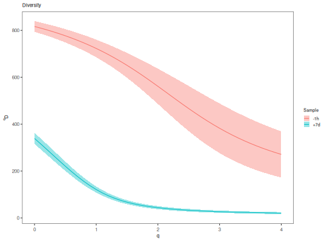
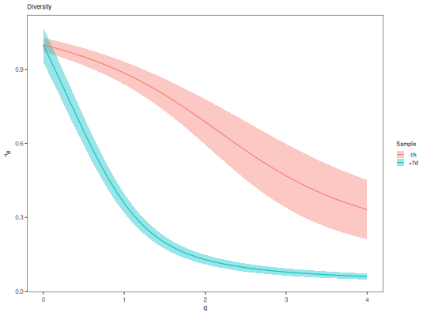

**plotDiversityCurve** - *Plot the results of alphaDiversity*

Description
--------------------

`plotDiversityCurve` plots a `DiversityCurve` object.


Usage
--------------------
```
plotDiversityCurve(
data,
colors = NULL,
main_title = "Diversity",
legend_title = "Group",
log_x = FALSE,
log_y = FALSE,
xlim = NULL,
ylim = NULL,
annotate = c("none", "depth"),
score = c("diversity", "evenness"),
silent = FALSE,
...
)
```

Arguments
-------------------

data
:   [DiversityCurve](DiversityCurve-class.md) object returned by 
[alphaDiversity](alphaDiversity.md).

colors
:   named character vector whose names are values in the 
`group` column of the `data` slot of `data`,
and whose values are colors to assign to those group names.

main_title
:   string specifying the plot title.

legend_title
:   string specifying the legend title.

log_x
:   if `TRUE` then plot <code class = 'eq'>q</code> on a log scale;
if `FALSE` plot on a linear scale.

log_y
:   if `TRUE` then plot the diversity/evenness scores 
on a log scale; if `FALSE` plot on a linear scale.

xlim
:   numeric vector of two values specifying the 
`c(lower, upper)` x-axis limits.

ylim
:   numeric vector of two values specifying the 
`c(lower, upper)` y-axis limits.

annotate
:   string defining whether to added values to the group labels 
of the legend. When `"none"` (default) is specified no
annotations are added. Specifying (`"depth"`) adds 
sequence counts to the labels.

score
:   one of `"diversity"` or `"evenness"` specifying which
score to plot on the y-asis.

silent
:   if `TRUE` do not draw the plot and just return the ggplot2 
object; if `FALSE` draw the plot.

...
:   additional arguments to pass to ggplot2::theme.


Value
-------------------

A `ggplot` object defining the plot.


Examples
-------------------

```R
# Calculate diversity
div <- alphaDiversity(ExampleDb, group="sample_id", nboot=100)

# Plot diversity
plotDiversityCurve(div, legend_title="Sample")

```



```R

#' # Plot diversity
plotDiversityCurve(div, legend_title="Sample", score="evenness")
```




See also
-------------------

See [alphaDiversity](alphaDiversity.md) and [alphaDiversity](alphaDiversity.md) for generating 
[DiversityCurve](DiversityCurve-class.md) objects for input. Plotting is performed with [ggplot](http://www.rdocumentation.org/packages/ggplot2/topics/ggplot).


