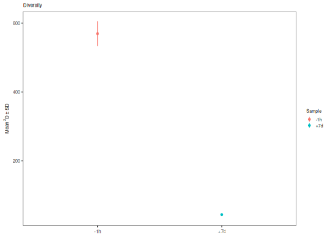

**plotDiversityTest** - *Plot the results of diversity testing*

Description
--------------------

`plotDiversityTest` plots summary data for a `DiversityCurve` object 
with mean and a line range indicating plus/minus one standard deviation.


Usage
--------------------
```
plotDiversityTest(data, q, colors = NULL, main_title = "Diversity",
legend_title = "Group", log_d = FALSE, annotate = c("none",
"depth"), silent = FALSE, ...)
```

Arguments
-------------------

data
:   [DiversityCurve](DiversityCurve-class.md) object returned by 
[alphaDiversity](alphaDiversity.md).

q
:   diversity order to plot the test for.

colors
:   named character vector whose names are values in the 
`group` column of the `data` slot of `data`,
and whose values are colors to assign to those group names.

main_title
:   string specifying the plot title.

legend_title
:   string specifying the legend title.

log_d
:   if `TRUE` then plot the diversity scores <code class = 'eq'>D</code> 
on a log scale; if `FALSE` plot on a linear scale.

annotate
:   string defining whether to added values to the group labels 
of the legend. When `"none"` (default) is specified no
annotations are added. Specifying (`"depth"`) adds 
sequence counts to the labels.

silent
:   if `TRUE` do not draw the plot and just return the ggplot2 
object; if `FALSE` draw the plot.

...
:   additional arguments to pass to ggplot2::theme.


Value
-------------------

A `ggplot` object defining the plot.


Examples
-------------------

```R
# Calculate diversity
div <- alphaDiversity(ExampleDb, group="sample_id", min_q=0, max_q=2, step_q=1, nboot=100)

# Plot results at q=0 (equivalent to species richness)
plotDiversityTest(div, 0, legend_title="Sample")

```


```R

# Plot results at q=2 (equivalent to Simpson's index)
plotDiversityTest(div, q=2, legend_title="Sample")
```




See also
-------------------

See [alphaDiversity](alphaDiversity.md) for generating input.
Plotting is performed with [ggplot](http://www.rdocumentation.org/packages/ggplot2/topics/ggplot).


