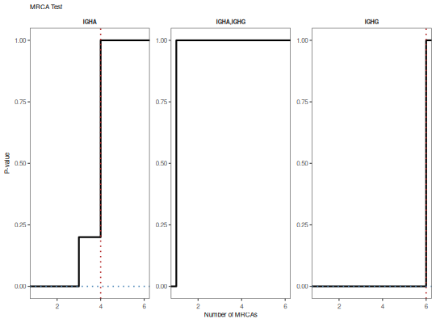

**plotMRCATest** - *Plot the results of a founder permutation test*

Description
--------------------

`plotMRCATest` plots the results of a founder permutation test performed with 
`testMRCA`.


Usage
--------------------
```
plotMRCATest(data, color = "black", main_title = "MRCA Test",
style = c("histogram", "cdf"), silent = FALSE, ...)
```

Arguments
-------------------

data
:   [MRCATest](MRCATest-class.md) object returned by [testMRCA](testMRCA.md).

color
:   color of the histogram or lines.

main_title
:   string specifying the plot title.

style
:   type of plot to draw. One of:

+  `"histogram"`:  histogram of the annotation count 
distribution with a red dotted line
denoting the observed value.
+  `"cdf"`:        cumulative distribution function 
of annotation counts with a red dotted 
line denoting the observed value and
a blue dotted line indicating the 
p-value.


silent
:   if `TRUE` do not draw the plot and just return the ggplot2 
object; if `FALSE` draw the plot.

...
:   additional arguments to pass to ggplot2::theme.


Value
-------------------

A `ggplot` object defining the plot.


Examples
-------------------

```R
# Define example tree set
graphs <- ExampleTrees[1-10]

# Perform MRCA test on isotypes
x <- testMRCA(graphs, "c_call", nperm=10)

```


```


```


```R

# Plot
plotMRCATest(x, color="steelblue", style="hist")

```


```R
plotMRCATest(x, style="cdf")
```




See also
-------------------

See [testEdges](testEdges.md) for performing the test.


