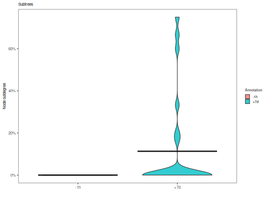
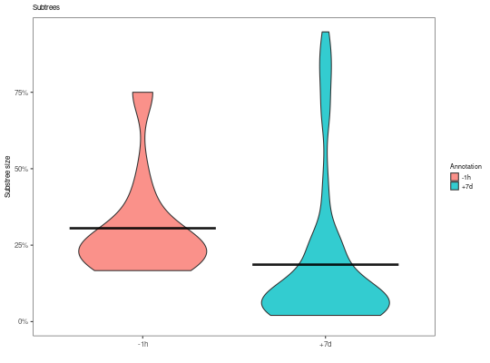
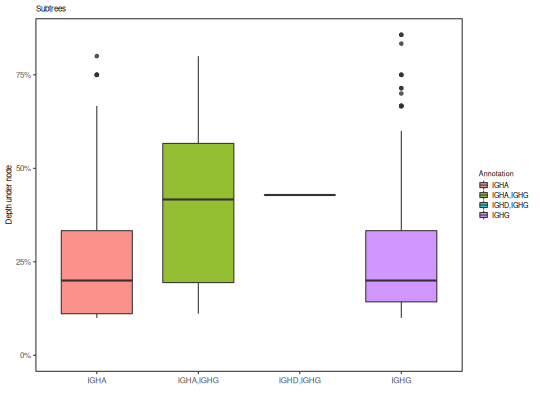

**plotSubtrees** - *Plots subtree statistics for multiple trees*

Description
--------------------

`plotSubtree` plots distributions of normalized subtree statistics for a 
set of lineage trees, broken down by annotation value.


Usage
--------------------
```
plotSubtrees(
graphs,
field,
stat,
root = "Germline",
exclude = c("Germline", NA),
colors = NULL,
main_title = "Subtrees",
legend_title = "Annotation",
style = c("box", "violin"),
silent = FALSE,
...
)
```

Arguments
-------------------

graphs
:   list of igraph objects containing annotated lineage trees.

field
:   string defining the annotation field.

stat
:   string defining the subtree statistic to plot. One of:

+ `outdegree`:   distribution of normalized node 
outdegrees.
+ `size`:        distribution of normalized subtree sizes.
+ `depth`:       distribution of subtree depths.
+ `pathlength`:  distribution of maximum pathlength 
beneath nodes.


root
:   name of the root (germline) node.

exclude
:   vector of strings defining `field` values to exclude from
plotting.

colors
:   named vector of colors for values in `field`, with 
names defining annotation names `field` column and values
being colors. Also controls the order in which values appear on the
plot. If `NULL` alphabetical ordering and a default color palette 
will be used.

main_title
:   string specifying the plot title.

legend_title
:   string specifying the legend title.

style
:   string specifying the style of plot to draw. One of:

+  `"histogram"`:  histogram of the annotation count 
distribution with a red dotted line
denoting the observed value.
+  `"cdf"`:        cumulative distribution function 
of annotation counts with a red 
dotted line denoting the observed 
value and a blue dotted line 
indicating the p-value.


silent
:   if `TRUE` do not draw the plot and just return the ggplot2 
object; if `FALSE` draw the plot.

...
:   additional arguments to pass to ggplot2::theme.


Value
-------------------

A `ggplot` object defining the plot.


Examples
-------------------

```R
# Define example tree set
graphs <- ExampleTrees[1:10]

# Violin plots of node outdegree by sample
plotSubtrees(graphs, "sample_id", "out", style="v")

```



```R

# Violin plots of subtree size by sample
plotSubtrees(graphs, "sample_id", "size", style="v")

```



```R

# Boxplot of node depth by isotype
plotSubtrees(graphs, "c_call", "depth", style="b")

```




See also
-------------------

Subtree statistics are calculated with [summarizeSubtrees](summarizeSubtrees.md).


