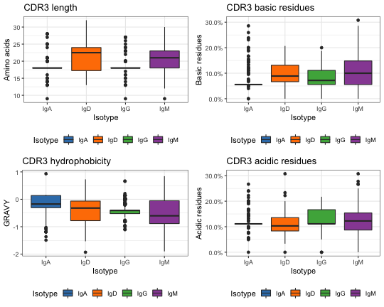

Analysis of amino acid physicochemical properties
====================


The `alakazam` package includes a set of function to analyze the physicochemical 
properties of Ig and TCR amino acid sequences. Of particular interest is the analysis of 
CDR3 properties, which this vignette will demonstate. However, the same process
can be applied to other regions simply by altering the sequence data column used.

    Wu YC, et al. High-throughput immunoglobulin repertoire analysis distinguishes 
        between human IgM memory and switched memory B-cell populations. 
        Blood 116, 1070-8 (2010).
    Wu YC, et al. The relationship between CD27 negative and positive B cell 
        populations in human peripheral blood. 
        Front Immunol 2, 1-12 (2011).


Load Change-O data
--------------------------------------------------------------------------------
A small example Change-O tab-delimited database file is included in the 
`alakazam` package. 


```r
library(alakazam)

# Load Change-O file
file <- system.file("extdata", "ExampleDb.gz", package="alakazam")
db <- readChangeoDb(file)
db <- db[db$SAMPLE == "RL01", ]
```

Calculate the properties of amino acid sequences
--------------------------------------------------------------------------------
Multiple amino acid physicochemical properties can be obtained with the function 
`aminoAcidProperties`. The available properties are:

* `length`: total amino acid count
* `gravy`: grand average of hydrophobicity
* `bulkiness`: average bulkiness
* `polarity`: average polarity
* `aliphatic`: normalized aliphatic index
* `charge`: normalized net charge
* `acidic`: acidic side chain content
* `basic`: basic side chain residue content
* `aromatic`: aromatic side chain content

This example demonstrates how to calculate all of the available amino acid 
properties from DNA sequences found in `JUNCTION` column of the Change-O file 
previously loaded. 

Translation of the DNA sequences to amino acid sequences is accomplished by 
specifying the `nt=TRUE` argument. To reduce the junction sequence to the CDR3 
sequence we specify the argument `trim=TRUE` which will strip the first and last
codon (the conserved residues) prior to analysis. The prefix `CDR3` is added
to the output column names using the `label="CDR3"` argument.


```r
db_props <- aminoAcidProperties(db, seq="JUNCTION", nt=TRUE, trim=TRUE, 
                                label="CDR3")

# The full set of properties are calculated by default
dplyr::select(db_props[1:3, ], starts_with("CDR3"))
```

```
##   CDR3_AA_LENGTH CDR3_AA_GRAVY CDR3_AA_BULK CDR3_AA_ALIPHATIC
## 1             20        -1.090      14.1520             0.440
## 2             20         0.275      15.0665             1.025
## 3             20         0.275      15.0665             1.025
##   CDR3_AA_POLARITY CDR3_AA_CHARGE CDR3_AA_BASIC CDR3_AA_ACIDIC
## 1            8.860     0.20001382          0.25           0.05
## 2            7.645    -0.05026748          0.05           0.10
## 3            7.645    -0.05026748          0.05           0.10
##   CDR3_AA_AROMATIC
## 1             0.05
## 2             0.20
## 3             0.20
```

```r
# Plot a subset of the properties
tmp_theme <- theme_bw() + theme(legend.position="bottom")
g1 <- ggplot(db_props, aes(x=ISOTYPE, y=CDR3_AA_LENGTH)) + tmp_theme +
    ggtitle("CDR3 length") + 
    xlab("Isotype") + ylab("Amino acids") +
    scale_fill_manual(name="Isotype", values=IG_COLORS) +
    geom_boxplot(aes(fill=ISOTYPE))
g2 <- ggplot(db_props, aes(x=ISOTYPE, y=CDR3_AA_GRAVY)) + tmp_theme + 
    ggtitle("CDR3 hydrophobicity") + 
    xlab("Isotype") + ylab("GRAVY") +
    scale_fill_manual(name="Isotype", values=IG_COLORS) +
    geom_boxplot(aes(fill=ISOTYPE))
g3 <- ggplot(db_props, aes(x=ISOTYPE, y=CDR3_AA_BASIC)) + tmp_theme +
    ggtitle("CDR3 basic residues") + 
    xlab("Isotype") + ylab("Basic residues") +
    scale_y_continuous(labels=scales::percent) +
    scale_fill_manual(name="Isotype", values=IG_COLORS) +
    geom_boxplot(aes(fill=ISOTYPE))
g4 <- ggplot(db_props, aes(x=ISOTYPE, y=CDR3_AA_ACIDIC)) + tmp_theme +
    ggtitle("CDR3 acidic residues") + 
    xlab("Isotype") + ylab("Acidic residues") +
    scale_y_continuous(labels=scales::percent) +
    scale_fill_manual(name="Isotype", values=IG_COLORS) +
    geom_boxplot(aes(fill=ISOTYPE))
multiggplot(g1, g2, g3, g4, ncol=2)
```



## Obtaining properties individually ##

A subset of the properties may be calculated using the `property` argument of
`aminoAcidProperties`.  For example, calculations may be restricted to only the 
grand average of hydrophobicity (`gravy`) index and normalized net charge 
(`charge`) by specifying `property=c("gravy", "charge")`. 


```r
db_props <- aminoAcidProperties(db, seq="JUNCTION", property=c("gravy", "charge"),
                                nt=TRUE, trim=TRUE, label="CDR3")
dplyr::select(db_props[1:3, ], starts_with("CDR3"))
```

```
##   CDR3_AA_GRAVY CDR3_AA_CHARGE
## 1        -1.090     0.20001382
## 2         0.275    -0.05026748
## 3         0.275    -0.05026748
```

## Using user defined scales ##

Each property has a default scale setting, but users may specify alternate scales 
if they wish. The following example shows how to import and use the
Kidera et al, 1985 hydrophobicity scale and the Murrary et al, 2006 pK values from 
the `seqinr` package instead of the defaults for calculating the GRAVY index and 
net charge.


```r
# Load the relevant data objects from the seqinr package
library(seqinr)
data(aaindex)
data(pK)
h <- aaindex[["KIDA850101"]]$I
p <- setNames(pK[["Murray"]], rownames(pK))
# Rename the hydrophobicity vector to use single-letter codes
names(h) <- translateStrings(names(h), ABBREV_AA)
db_props <- aminoAcidProperties(db, seq="JUNCTION", property=c("gravy", "charge"), 
                                nt=TRUE, trim=TRUE, label="CDR3", 
                                hydropathy=h, pK=p)
dplyr::select(db_props[1:3, ], starts_with("CDR3"))
```

```
##   CDR3_AA_GRAVY CDR3_AA_CHARGE
## 1        0.4875     0.19998967
## 2       -0.2340    -0.05030493
## 3       -0.2340    -0.05030493
```

## Getting vectors of individual properties ##

The `aminoAcidProperties` function provides a convenient wrapper for calculating
multiple properties at once from a data.frame. If a vector of a specific property is
required this may be accomplished using one of the worker functions:

* `gravy`: grand average of hydrophobicity
* `bulk`: average bulkiness
* `polar`: average polarity
* `aliphatic`: aliphatic index
* `charge`: net charge
* `countPatterns`: counts the occurrence of patterns in amino acid sequences

The input to each function must be vector of amino acid sequences.


```r
# Translate junction DNA sequences to amino acids and trim first and last codons
cdr3 <- translateDNA(db$JUNCTION[1:3], trim=TRUE)

# Grand average of hydrophobicity
gravy(cdr3)
```

```
## [1] -1.090  0.275  0.275
```

```r
# Average bulkiness
bulk(cdr3)
```

```
## [1] 14.1520 15.0665 15.0665
```

```r
# Average polarity
polar(cdr3)
```

```
## [1] 8.860 7.645 7.645
```

```r
# Normalized aliphatic index
aliphatic(cdr3)
```

```
## [1] 0.440 1.025 1.025
```

```r
# Unnormalized aliphatic index
aliphatic(cdr3, normalize=FALSE)
```

```
## [1]  8.8 20.5 20.5
```

```r
# Normalized net charge
charge(cdr3)
```

```
## [1]  0.20001382 -0.05026748 -0.05026748
```

```r
# Unnormalized net charge
charge(cdr3, normalize=FALSE)
```

```
## [1]  4.000276 -1.005350 -1.005350
```

```r
# Count of acidic amino acids
# Takes a named list of regular expressions
countPatterns(cdr3, c(ACIDIC="[DE]"), label="CDR3")
```

```
##   CDR3_ACIDIC
## 1        0.05
## 2        0.10
## 3        0.10
```

Default scales
--------------------------------------------------------------------------------

The following references were used for the default physicochemical scales:

* Aliphatic index:  
  Ikai AJ. Thermostability and aliphatic index of globular proteins. 
        J Biochem 88, 1895-1898 (1980).
* Bulkiness scale:  
  Zimmerman JM, Eliezer N, Simha R. The characterization of amino acid sequences 
    in proteins by statistical methods. 
    J Theor Biol 21, 170-201 (1968).
* Hydrophobicity scale:  
  Kyte J, Doolittle RF. A simple method for displaying the hydropathic character 
    of a protein.
    J Mol Biol 157, 105-32 (1982).
* pK values:  
  \url{http://emboss.sourceforge.net/apps/cvs/emboss/apps/iep.html}
* Polarity scale:  
  Grantham R. Amino acid difference formula to help explain protein evolution. 
    Science 185, 862-864 (1974).
