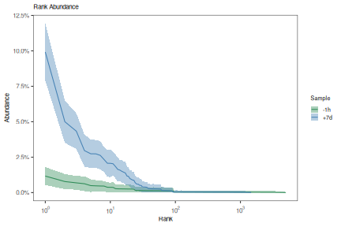
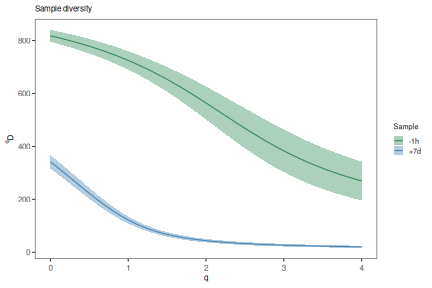
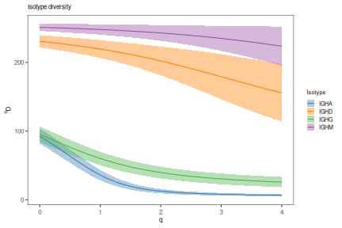
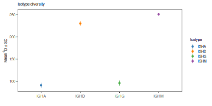
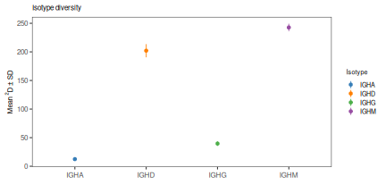

# Diversity analysis

The clonal diversity of the repertoire can be analyzed using the general form
of the diversity index, as proposed by Hill in:

    Hill, M. Diversity and evenness: a unifying notation and its consequences. 
        Ecology 54, 427-432 (1973).

Coupled with resampling strategies to correct for variations in sequencing 
depth, as well as inference of complete clonal abundance distributions as 
described in:

    Chao A, et al. Rarefaction and extrapolation with Hill numbers: 
        A framework for sampling and estimation in species diversity studies. 
        Ecol Monogr. 2014 84:45-67.
    Chao A, et al. Unveiling the species-rank abundance distribution by 
        generalizing the Good-Turing sample coverage theory. 
        Ecology. 2015 96, 11891201.

This package provides methods for the inference of a complete clonal 
abundance distribution (using the `estimateAbundance` function) along with 
two approaches to assess the diversity of these distributions: 

1. Generation of a smooth diversity (D) curve over a range of diversity orders (q) 
using `alphaDiversity`, and
2. A significance test of the diversity (D) at a fixed diversity order (q).


## Example data

A small example AIRR database, `ExampleDb`, is included in the `alakazam` package. 
Diversity calculation requires the `clone` field (column) to be present in the 
AIRR file, as well as an additional grouping column. In this example we 
will use the grouping columns `sample_id` and `c_call`.


``` r
# Load required packages
library(alakazam)

# Load example data
data(ExampleDb)
```

For details about the AIRR format, visit the [AIRR Community documentation site](https://docs.airr-community.org/en/stable/datarep/rearrangements.html).

## Generate a clonal abundance curve

A simple table of the observed clonal abundance counts and frequencies may be
generated using the `countClones` function either with or without copy numbers, where
the size of each clone is determined by the number of sequence members:


``` r
# Partitions the data based on the sample column
clones <- countClones(ExampleDb, group="sample_id")
head(clones, 5)
```

```
## # A tibble: 5 × 4
## # Groups:   sample_id [1]
##   sample_id clone_id seq_count seq_freq
##   <chr>        <dbl>     <int>    <dbl>
## 1 +7d           3128       100   0.100 
## 2 +7d           3100        50   0.0501
## 3 +7d           3141        44   0.0440
## 4 +7d           3177        30   0.0300
## 5 +7d           3170        28   0.0280
```

You may also specify a column containing the abundance count of each sequence 
(usually copy numbers), that will include weighting of each clone size by the 
corresponding abundance count. Furthermore, multiple grouping columns may be
specified such that `seq_freq` (unweighted clone size as a fraction
of total sequences in the group) and `copy_freq` (weighted fraction) are 
normalized to within multiple group data partitions.


``` r
# Partitions the data based on both the sample_id and c_call columns
# Weights the clone sizes by the duplicate_count column
clones <- countClones(ExampleDb, group=c("sample_id", "c_call"), copy="duplicate_count", clone="clone_id")
head(clones, 5)
```

```
## # A tibble: 5 × 7
## # Groups:   sample_id, c_call [2]
##   sample_id c_call clone_id seq_count copy_count seq_freq copy_freq
##   <chr>     <chr>     <dbl>     <int>      <dbl>    <dbl>     <dbl>
## 1 +7d       IGHA       3128        88        651   0.331     0.497 
## 2 +7d       IGHG       3100        49        279   0.0928    0.173 
## 3 +7d       IGHA       3141        44        240   0.165     0.183 
## 4 +7d       IGHG       3192        19        141   0.0360    0.0874
## 5 +7d       IGHG       3177        29        130   0.0549    0.0806
```

While `countClones` will report observed abundances, it will not provide confidence 
intervals. A complete clonal abundance distribution may be inferred using the 
`estimateAbundance` function with confidence intervals derived via bootstrapping.  
This output may be visualized using the `plotAbundanceCurve` function.


``` r
# Partitions the data on the sample column
# Calculates a 95% confidence interval via 100 bootstrap realizations
curve <- estimateAbundance(ExampleDb, group="sample_id", ci=0.95, nboot=100, clone="clone_id")
```


``` r
# Plots a rank abundance curve of the relative clonal abundances
sample_colors <- c("-1h"="seagreen", "+7d"="steelblue")
plot(curve, colors = sample_colors, legend_title="Sample")
```



## Generate a diversity curve

The function `alphaDiversity` performs uniform resampling of the input 
sequences and recalculates the clone size distribution, and diversity, with each 
resampling realization. Diversity (D) is calculated over a range of diversity 
orders (q) to generate a smooth curve.


``` r
# Compare diversity curve across values in the "sample" column
# q ranges from 0 (min_q=0) to 4 (max_q=4) in 0.05 increments (step_q=0.05)
# A 95% confidence interval will be calculated (ci=0.95)
# 100 resampling realizations are performed (nboot=100)
sample_curve <- alphaDiversity(ExampleDb, group="sample_id", clone="clone_id",
                               min_q=0, max_q=4, step_q=0.1,
                               ci=0.95, nboot=100)

# Compare diversity curve across values in the c_call column
# Analyse is restricted to c_call values with at least 30 sequences by min_n=30
# Excluded groups are indicated by a warning message
isotype_curve <- alphaDiversity(ExampleDb, group="c_call", clone="clone_id",
                                min_q=0, max_q=4, step_q=0.1,
                                ci=0.95, nboot=100)
```


``` r
# Plot a log-log (log_q=TRUE, log_d=TRUE) plot of sample diversity
# Indicate number of sequences resampled from each group in the title
sample_main <- paste0("Sample diversity")
sample_colors <- c("-1h"="seagreen", "+7d"="steelblue")
plot(sample_curve, colors=sample_colors, main_title=sample_main, 
     legend_title="Sample")
```



``` r
# Plot isotype diversity using default set of Ig isotype colors
isotype_main <- paste0("Isotype diversity")
plot(isotype_curve, colors=IG_COLORS, main_title=isotype_main, 
     legend_title="Isotype")
```




## View diversity tests at a fixed diversity order

Significance testing across groups is performed using the delta of the bootstrap
distributions between groups when running `alphaDiversity` for all values of `q` 
specified.


``` r
# Test diversity at q=0, q=1 and q=2 (equivalent to species richness, Shannon entropy, 
# Simpson's index) across values in the sample_id column
# 100 bootstrap realizations are performed (nboot=100)
isotype_test <- alphaDiversity(ExampleDb, group="c_call", min_q=0, max_q=2, step_q=1, nboot=100, clone="clone_id")

# Print P-value table
print(isotype_test@tests)
```

```
## # A tibble: 18 × 5
##    test         q     delta_mean delta_sd pvalue
##    <chr>        <chr>      <dbl>    <dbl>  <dbl>
##  1 IGHA != IGHD 0          140.      7.64   0   
##  2 IGHA != IGHD 1          184.      7.47   0   
##  3 IGHA != IGHD 2          191.     10.3    0   
##  4 IGHA != IGHG 0            5.1     8.25   0.66
##  5 IGHA != IGHG 1           25.2     6.38   0   
##  6 IGHA != IGHG 2           27.3     4.37   0   
##  7 IGHA != IGHM 0          159.      6.25   0   
##  8 IGHA != IGHM 1          211.      5.69   0   
##  9 IGHA != IGHM 2          229.      6.62   0   
## 10 IGHD != IGHG 0          135.      7.08   0   
## 11 IGHD != IGHG 1          159.      7.56   0   
## 12 IGHD != IGHG 2          164.     10.6    0   
## 13 IGHD != IGHM 0           19.1     4.87   0   
## 14 IGHD != IGHM 1           26.7     7.05   0   
## 15 IGHD != IGHM 2           37.8    11.4    0   
## 16 IGHG != IGHM 0          154.      6.30   0   
## 17 IGHG != IGHM 1          186.      6.17   0   
## 18 IGHG != IGHM 2          201.      7.10   0
```

``` r
# Plot results at q=0 and q=2
# Plot the mean and standard deviations at q=0 and q=2
plot(isotype_test, 0, colors=IG_COLORS, main_title=isotype_main, 
     legend_title="Isotype")
```



``` r
plot(isotype_test, 2, colors=IG_COLORS, main_title=isotype_main, 
     legend_title="Isotype")
```


