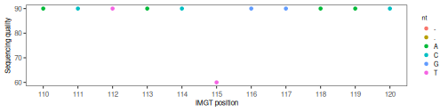

# Fastq

The `alakazam` package includes a set of functions to inspect the sequencing quality.

## Example data

Load example data:


```r
library(alakazam)
library(dplyr)
library(airr)

db <- read_rearrangement(system.file("extdata", "example_quality.tsv", package="alakazam"))
fastq_file <- system.file("extdata", "example_quality.fastq", package="alakazam")
```

## Load quality scores

This method allows to add the quality scores to the repertoire `data.frame` as strings.


```r
original_cols <- colnames(db)
db <- readFastqDb(db, fastq_file, style="both", quality_sequence=TRUE)
new_cols <- setdiff(colnames(db), original_cols)
db[,new_cols] %>% head()
```

```
## # A tibble: 1 x 4
##   quality_num                                         quality                                        quality_alignment_num                                  quality_alignment                                     
##   <chr>                                               <chr>                                          <chr>                                                  <chr>                                                 
## 1 90,90,90,90,90,90,90,90,90,90,90,90,90,90,90,90,90… {{{{{{{{{{{{{{{{{{{{{{{{{{{{{{{{{{{{{{{{{{{{{… 90,90,90,90,90,90,90,90,90,90,90,90,90,90,90,90,90,90… {{{{{{{{{{{{{{{{{{{{{{{{{{{   {{{{{{{{{{{{{{{{{{{{{{{…
```

The function `readFastq` takes as main inputs a repertoire `data.frame` (`db`) and 
a path to the corresponding `.fastq` file (`fastq_file`). The sequencing quality scores will
be merged into the `data.frame` by `sequence_id`. The newly added columns are:
quality_num, quality, quality_alignment_num, quality_alignment. The other fields, contain the ASCII quality scores in the 
form of a vector, where values are comma separated, and `-` or `.` positions 
have value `" "` (blank).

After loading the quality scores with `readFastqDb`,  `getPositionQuality`
can be used to generate a `data.frame` of sequencing quality values 
per position.


```r
quality <- getPositionQuality(db, sequence_id="sequence_id", 
                              sequence="sequence_alignment",
                              quality_num="quality_alignment_num")
```

```
## Warning in FUN(X[[i]], ...): NAs introduced by coercion
```

```r
head(quality)
```

```
##   position quality_alignment_num       sequence_id nt
## 1        1                    90 CGCTTTTCGGATTGGAA  C
## 2        2                    90 CGCTTTTCGGATTGGAA  A
## 3        3                    90 CGCTTTTCGGATTGGAA  G
## 4        4                    90 CGCTTTTCGGATTGGAA  C
## 5        5                    90 CGCTTTTCGGATTGGAA  T
## 6        6                    90 CGCTTTTCGGATTGGAA  G
```


```r
min_pos <- min(quality$position)
max_pos <- max(quality$position)

ggplot(quality, aes(x=position,
                    y=quality_alignment_num,
                    color=nt)) +
  geom_point() +
  coord_cartesian(xlim=c(110,120)) +
  xlab("IMGT position") +
  ylab("Sequencing quality") +
  scale_fill_gradient(low = "light blue",  high = "dark red") +
  scale_x_continuous(breaks=c(min_pos:max_pos)) +
  alakazam::baseTheme()
```

```
## Warning: Removed 27 rows containing missing values (geom_point).
```



You can add use the quality `data.frame` to complement analysis performed
with other tools from the Immcantation framework. For example, you could inspect
the sequencing quality of novel polymorphisms identified with `tigger`, or
the sequencing quality in mutated/unmutated regions.

## Mask low quality positions

Use `maskPositionsByQuality` to mask low quality positions. Positions with
a sequencing quality < `min_quality` will be replaced with an 'N'. A message
will show the number of sequences in `db` that had at least one position
masked.


```r
db <- maskPositionsByQuality(db, min_quality=70,
                             sequence="sequence_alignment",
                             quality="quality_alignment_num")
```

```
## Number of masked sequences: 1
```

