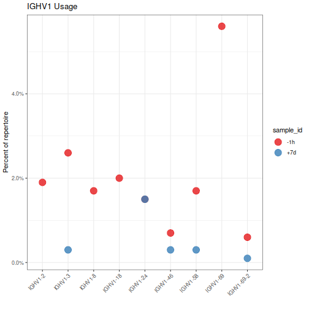
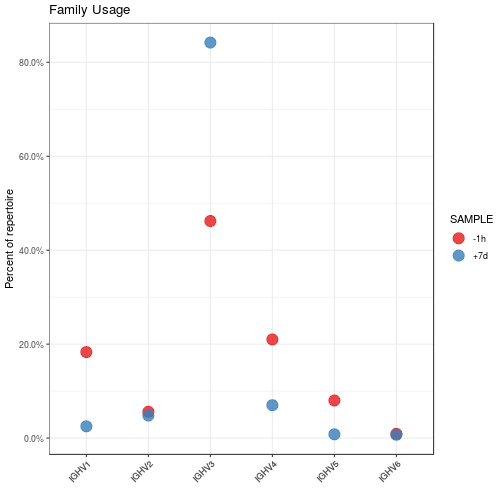
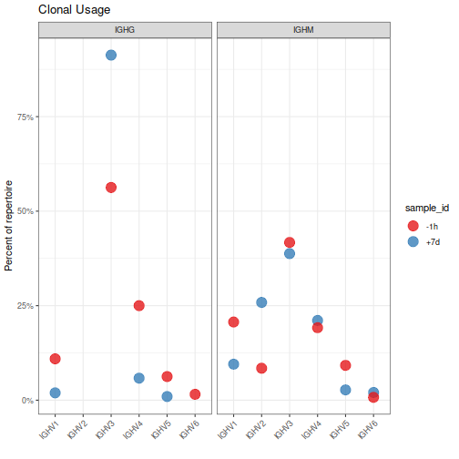
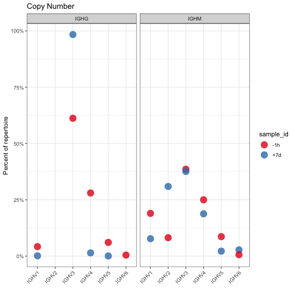

# Gene usage analysis

The 'alakazam' package provides basic gene usage quantification by either sequence count 
or clonal grouping; with or without consideration of duplicate reads/mRNA. Additionally, 
a set of accessory functions for sorting and parsing V(D)J gene names 
are also provided.

## Example data

A small example AIRR database, `ExampleDb`, is included in the `alakazam` package. For details 
about the AIRR format, visit the [AIRR Community documentation site](https://docs.airr-community.org/en/stable/datarep/rearrangements.html).

Gene usage analysis requires only the following columns:

* `v_call`
* `d_call`
* `j_call`

However, the optional clonal clustering (`clone_id`) and duplicate count (`duplicate_count`) 
columns may be used to quantify usage by different abundance criteria.


```r
# Load required packages
library(alakazam)
library(dplyr)
library(scales)

# Subset example data
data(ExampleDb)
```

## Tabulate V(D)J allele, gene or family usage by sample

The relative abundance of V(D)J alleles, genes or families within groups can be obtained 
with the function `countGenes`. To analyze differences in the V gene usage across 
different samples we will set `gene="v_call"` (the column containing gene data) and 
`groups="sample_id"` (the columns containing grouping variables). To quantify abundance at
the gene level we set `mode="gene"`:


```r
# Quantify usage at the gene level
gene <- countGenes(ExampleDb, gene="v_call", groups="sample_id", mode="gene")
head(gene, n=4)
```

```
## # A tibble: 4 x 4
## # Groups:   sample_id [2]
##   sample_id gene     seq_count seq_freq
##   <chr>     <chr>        <int>    <dbl>
## 1 +7d       IGHV3-49       698    0.699
## 2 -1h       IGHV3-9         83    0.083
## 3 -1h       IGHV5-51        60    0.06 
## 4 -1h       IGHV3-30        58    0.058
```

In the resultant `data.frame`, the `seq_count` column is the number of raw sequences within each `sample_id` 
group for the given `gene`. `seq_freq` is the frequency of each `gene` within the given `sample_id`.

Below we plot only the IGHV1 abundance by filtering on the `gene` column to only rows 
containing IGHV1 family genes. We extract the family portion of the gene name using the 
`getFamily` function. Also, we take advantage of the `sortGenes` function to convert the 
`gene` column to a factor with gene name lexicographically ordered in the factor levels 
(`method="name"`) for axis ordering using the `ggplot2` package. Alternatively, we could have 
ordered the genes by genomic position by passing `method="position"` to `sortGenes`.


```r
# Assign sorted levels and subset to IGHV1
ighv1 <- gene %>%
    mutate(gene=factor(gene, levels=sortGenes(unique(gene), method="name"))) %>%
    filter(getFamily(gene) == "IGHV1")

# Plot V gene usage in the IGHV1 family by sample
g1 <- ggplot(ighv1, aes(x=gene, y=seq_freq)) +
    theme_bw() +
    ggtitle("IGHV1 Usage") +
    theme(axis.text.x=element_text(angle=45, hjust=1, vjust=1)) +
    ylab("Percent of repertoire") +
    xlab("") +
    scale_y_continuous(labels=percent) +
    scale_color_brewer(palette="Set1") +
    geom_point(aes(color=sample_id), size=5, alpha=0.8)
plot(g1)
```



Alternatively, usage can be quantified at the allele (`mode="allele"`) or 
family level (`mode="family"`):


```r
# Quantify V family usage by sample
family <- countGenes(ExampleDb, gene="v_call", groups="sample_id", mode="family")

# Plot V family usage by sample
g2 <- ggplot(family, aes(x=gene, y=seq_freq)) +
    theme_bw() +
    ggtitle("Family Usage") +
    theme(axis.text.x=element_text(angle=45, hjust=1, vjust=1)) +
    ylab("Percent of repertoire") +
    xlab("") +
    scale_y_continuous(labels=percent) +
    scale_color_brewer(palette="Set1") +
    geom_point(aes(color=sample_id), size=5, alpha=0.8)
plot(g2)
```




## Tabulating gene abundance using additional groupings

The `groups` argument to `countGenes` can accept multiple grouping columns and
will calculate abundance within each unique combination. In the examples below,
groupings will be perform by unique sample and isotype pairs 
(`groups=c("sample_id", "c_call")`). Furthermore, instead of quantifying abundance
by sequence count, we will quantify it by clone count (each clone will
be counted only once regardless of how many sequences the clone represents).  
Clonal criteria are added by passing a value to the `clone` argument of `countGenes`
(`clone="clone_id"`). For each clonal group, only the most common allele/gene/family will
be considered for counting.


```r
# Quantify V family clonal usage by sample and isotype
family <- countGenes(ExampleDb, gene="v_call", groups=c("sample_id", "c_call"), 
                     clone="clone_id", mode="family")
head(family, n=4)
```

```
## # A tibble: 4 x 5
## # Groups:   sample_id, c_call [3]
##   sample_id c_call gene  clone_count clone_freq
##   <chr>     <chr>  <chr>       <int>      <dbl>
## 1 -1h       IGHA   IGHV2           1     0.0149
## 2 -1h       IGHG   IGHV6           1     0.0156
## 3 +7d       IGHA   IGHV5           1     0.0172
## 4 +7d       IGHA   IGHV6           1     0.0172
```

The output `data.frame` contains the additional grouping column (`c_call`) along with the 
`clone_count` and `clone_freq` columns that represent the count of clones for each V family 
and the frequencies within the given `sample_id` and `c_call` pair, respectively.


```r
# Subset to IGHM and IGHG for plotting
family <- filter(family, c_call %in% c("IGHM", "IGHG"))
# Plot V family clonal usage by sample and isotype
g3 <- ggplot(family, aes(x=gene, y=clone_freq)) +
    theme_bw() +
    ggtitle("Clonal Usage") +
    theme(axis.text.x=element_text(angle=45, hjust=1, vjust=1)) +
    ylab("Percent of repertoire") +
    xlab("") +
    scale_y_continuous(labels=percent) +
    scale_color_brewer(palette="Set1") +
    geom_point(aes(color=sample_id), size=5, alpha=0.8) +
    facet_grid(. ~ c_call)
plot(g3)
```



Instead of calculating abundance by sequence or clone count, abundance can be calculated
using copy numbers for the individual sequences. This is accomplished by passing
a copy number column to the `copy` argument (`copy="duplicate_count"`). Specifying both
`clone` and `copy` arguments is not meaningful and will result in the `clone` argument
being ignored.


```r
# Calculate V family copy numbers by sample and isotype
family <- countGenes(ExampleDb, gene="v_call", groups=c("sample_id", "c_call"), 
                     mode="family", copy="duplicate_count")
head(family, n=4)
```

```
## # A tibble: 4 x 7
## # Groups:   sample_id, c_call [3]
##   sample_id c_call gene  seq_count copy_count seq_freq copy_freq
##   <chr>     <chr>  <chr>     <int>      <dbl>    <dbl>     <dbl>
## 1 +7d       IGHG   IGHV3       516       1587    0.977     0.984
## 2 +7d       IGHA   IGHV3       240       1224    0.902     0.935
## 3 -1h       IGHM   IGHV3       237        250    0.421     0.386
## 4 -1h       IGHM   IGHV4       110        162    0.195     0.25
```

The output `data.frame` includes the `seq_count` and `seq_freq` columns as previously defined, 
as well as the additional copy number columns `copy_count` and `copy_freq` reflected the summed 
copy number (`duplicate_count`) for each sequence within the given `gene`, `sample_id` and `c_call`.


```r
# Subset to IGHM and IGHG for plotting
family <- filter(family, c_call %in% c("IGHM", "IGHG"))
# Plot V family copy abundance by sample and isotype
g4 <- ggplot(family, aes(x=gene, y=copy_freq)) +
    theme_bw() +
    ggtitle("Copy Number") +
    theme(axis.text.x=element_text(angle=45, hjust=1, vjust=1)) +
    ylab("Percent of repertoire") +
    xlab("") +
    scale_y_continuous(labels=percent) +
    scale_color_brewer(palette="Set1") +
    geom_point(aes(color=sample_id), size=5, alpha=0.8) +
    facet_grid(. ~ c_call)
plot(g4)
```


