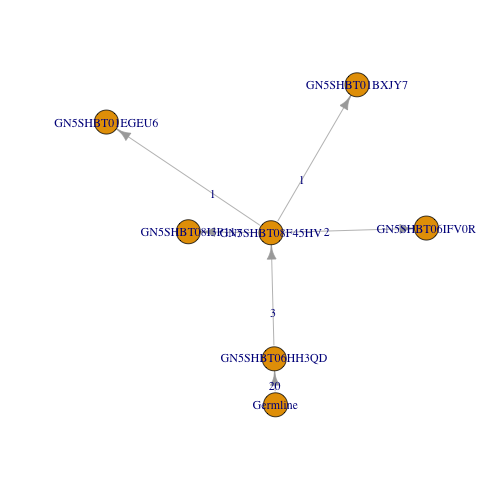
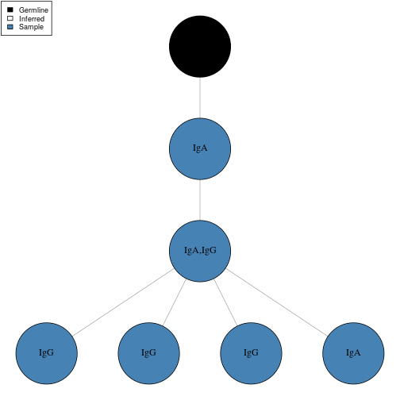

Lineage reconstruction
====================


Reconstruction of an Ig lineage requires the following steps:

1. Load a Change-O tab-delimited database file and select a clone
2. Preprocess the clone to remove gap characters and duplicate sequences
3. Run PHYLIP, parse the output, and modify the tree topology

## Example data

A small example Change-O database, `ExampleDb`, is included in the `alakazam` package. 
Lineage reconstruction requires the following fields (columns) to be present 
in the Change-O file: 

* `SEQUENCE_ID`
* `SEQUENCE_IMGT` 
* `CLONE`
* `GERMLINE_IMGT_D_MASK`
* `V_CALL`
* `J_CALL`
* `JUNCTION_LENGTH`


```r
# Load required packages
library(alakazam)
library(igraph)
library(dplyr)

# Select clone from example database
data(ExampleDb)
sub_db <- subset(ExampleDb, CLONE == 3138)
```

## Preprocess a clone

Before a lineage can be constructed the sequences must first be cleaned of gap
(-, .) characters added by IMGT, duplicate sequences must be removed, and
annotations must be combined for each cluster of duplicate sequences. 
Optionally, "ragged" ends of sequences, such as may occur from primer template
switching, may also be cleaned by masking mismatched positions and the leading
and trailing ends of each sequence. The function `makeChangeoClone` is a wrapper
function which combines these steps and returns a `ChangeoClone` object which
may then be passed into the lineage reconstruction function.

Two arguments to `makeChangeoClone` control which annotations are retained
following duplicate removal. Unique values appearing within columns given by the 
`text_fields` arguments will be concatenated into a single string delimited by a
"," character. Values appearing within columns given by the 
`num_fields` arguments will be summed.


```r
# This example data set does not have ragged ends
# Preprocess clone without ragged end masking (default)
clone <- makeChangeoClone(sub_db, text_fields=c("SAMPLE", "ISOTYPE"), 
                          num_fields="DUPCOUNT")

# Show combined annotations
clone@data[, c("SAMPLE", "ISOTYPE", "DUPCOUNT")]
```

```
##   SAMPLE ISOTYPE DUPCOUNT
## 1    +7d     IgA        1
## 2    +7d     IgG        1
## 3    +7d IgA,IgG       10
## 4    +7d     IgG       36
## 5    +7d     IgA       10
## 6    +7d     IgG       13
```

## Run PHYLIP

Lineage construction uses the `dnapars` (maximum parsimony) application of the
PHYLIP package. The function `buildPhylipLineage` performs a number of steps to
execute `dnapars`, parse its output, and modify the tree topology to meet the
criteria of an Ig lineage. This function takes as input a `ChangeoClone` object
output by `makeChangeoClone` and returns an igraph `graph` object. The igraph
`graph` object will contain clone annotations as graph attributes, sequence 
annotations as vertex attributes, and mutations along edges as edge attributes.

The system call to `dnapars` requires a temporary folder to store input and 
output. This is created in the system temporary location (according to 
`base::tempfile`), and is not deleted by default (only because automatically 
deleting files is somewhat rude).  In most cases, you will want to set 
`rm_temp=TRUE` to delete this folder.


```r
# Run PHYLIP and parse output
dnapars_exec <- "~/apps/phylip-3.69/dnapars"
graph <- buildPhylipLineage(clone, dnapars_exec, rm_temp=TRUE)
```


```r
# The graph has shared annotations for the clone
data.frame(CLONE=graph$clone,
           JUNCTION_LENGTH=graph$junc_len,
           V_GENE=graph$v_gene,
           J_GENE=graph$j_gene)
```

```
##   CLONE JUNCTION_LENGTH   V_GENE J_GENE
## 1  3138              60 IGHV3-49  IGHJ5
```

```r
# The vertices have sequence specific annotations
data.frame(SEQUENCE_ID=V(graph)$name, 
           ISOTYPE=V(graph)$ISOTYPE,
           DUPCOUNT=V(graph)$DUPCOUNT)
```

```
##      SEQUENCE_ID ISOTYPE DUPCOUNT
## 1 GN5SHBT06HH3QD     IgA       10
## 2 GN5SHBT08F45HV IgA,IgG       10
## 3       Germline    <NA>       NA
## 4 GN5SHBT06IFV0R     IgG       13
## 5 GN5SHBT08I3P11     IgG       36
## 6 GN5SHBT01BXJY7     IgG        1
## 7 GN5SHBT01EGEU6     IgA        1
```

## Plotting of the lineage tree

Plotting of a lineage tree may be done using the built-in functions of the 
igraph package. The default edge and vertex labels are edge weights and sequence 
identifiers, respectively. 


```r
# Plot graph with defaults
plot(graph)
```



The default layout and attributes are not very pretty. We can modify the 
graphical parameter in the usual igraph ways. A tree layout can be built using 
the `layout_as_tree` layout with assignment of the root position to the 
germline sequence, which is named "Germline" in the object returned by 
`buildPhylipLineage`.


```r
# Modify graph and plot attributes
V(graph)$color <- "steelblue"
V(graph)$color[V(graph)$name == "Germline"] <- "black"
V(graph)$color[grepl("Inferred", V(graph)$name)] <- "white"
V(graph)$label <- V(graph)$ISOTYPE
E(graph)$label <- ""

# Remove large default margins
par(mar=c(0, 0, 0, 0) + 0.1)
# Plot graph
plot(graph, layout=layout_as_tree, edge.arrow.mode=0, vertex.frame.color="black",
     vertex.label.color="black", vertex.size=40)
# Add legend
legend("topleft", c("Germline", "Inferred", "Sample"), 
       fill=c("black", "white", "steelblue"), cex=0.75)
```



Which is much better.

## Batch processing lineage trees

Multiple lineage trees may be generated at once, by splitting the Change-O 
data.frame on the clone column.


```r
# Preprocess clones
clones <- ExampleDb %>%
    group_by(CLONE) %>%
    do(CHANGEO=makeChangeoClone(., text_fields=c("SAMPLE", "ISOTYPE"), 
                                num_fields="DUPCOUNT"))
```


```r
# Build lineages
dnapars_exec <- "~/apps/phylip-3.69/dnapars"
graphs <- lapply(clones$CHANGEO, buildPhylipLineage, 
                 dnapars_exec=dnapars_exec, rm_temp=TRUE)
```


```r
# Note, clones with only a single sequence will not be processed.
# A warning will be generated and NULL will be returned by buildPhylipLineage
# These entries may be removed for clarity
graphs[sapply(graphs, is.null)] <- NULL

# The set of tree may then be subset by node count for further 
# analysis, if desired.
graphs <- graphs[sapply(graphs, vcount) >= 5]
```
