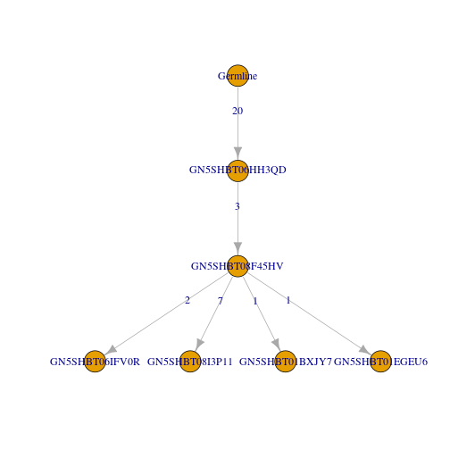
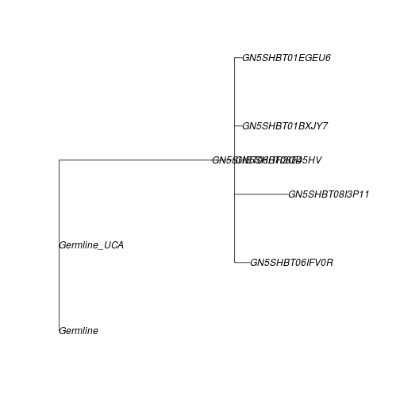
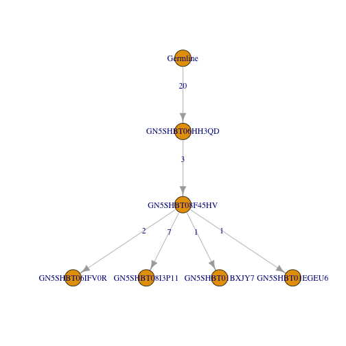

# Lineage reconstruction

Reconstruction of an Ig lineage requires the following steps:

1. Load an AIRR tab-delimited database file and select a clone
2. Preprocess the clone to remove gap characters and duplicate sequences
3. Run PHYLIP, parse the output, and modify the tree topology

## Example data

A small example AIRR database, `ExampleDb`, is included in the `alakazam` package. 
Lineage reconstruction requires the following fields (columns) to be present 
in the AIRR file: 

* `sequence_id`
* `sequence_alignment` 
* `germline_alignment`
* `v_call`
* `j_call`
* `junction_length`
* `clone_id`


```r
# Load required packages
library(alakazam)
library(igraph)
library(dplyr)

# Select a clone from the example database
data(ExampleDb)
sub_db <- subset(ExampleDb, clone_id == 3138)
```

## Preprocess a clone

Before a lineage can be constructed, the sequences must first be cleaned of gap
(-, .) characters added by IMGT, duplicate sequences must be removed, and
annotations must be combined for each cluster of duplicate sequences. 
Optionally, "ragged" ends of sequences (such as those that may occur from primer template
switching) may also be cleaned by masking mismatched positions and the leading
and trailing ends of each sequence. The function `makeChangeoClone` is a wrapper
function which combines these steps and returns a `ChangeoClone` object which
may then be passed into the lineage reconstruction function.

Two arguments to `makeChangeoClone` control which annotations are retained
following duplicate removal. Unique values appearing within columns given by the 
`text_fields` arguments will be concatenated into a single string delimited by a
"," character. Values appearing within columns given by the 
`num_fields` arguments will be summed.


```r
# This example data set does not have ragged ends
# Preprocess clone without ragged end masking (default)
clone <- makeChangeoClone(sub_db, text_fields=c("sample_id", "c_call"), 
                          num_fields="duplicate_count")

# Show combined annotations
clone@data[, c("sample_id", "c_call", "duplicate_count")]
```

```
##   sample_id    c_call duplicate_count
## 1       +7d      IGHA               1
## 2       +7d      IGHG               1
## 3       +7d IGHA,IGHG              10
## 4       +7d      IGHG              36
## 5       +7d      IGHA              10
## 6       +7d      IGHG              13
```

## Run PHYLIP

Lineage construction uses the `dnapars` (maximum parsimony) application of the
PHYLIP package. The function `buildPhylipLineage` performs a number of steps to
execute `dnapars`, parse its output, and modify the tree topology to meet the
criteria of an Ig lineage. This function takes as input a `ChangeoClone` object
output by `makeChangeoClone` and returns an igraph `graph` object. The igraph
`graph` object will contain clone annotations as graph attributes, sequence 
annotations as vertex attributes, and mutations along edges as edge attributes.

The system call to `dnapars` requires a temporary folder to store input and 
output. This is created in the system temporary location (according to 
`base::tempfile`), and is not deleted by default (only because automatically 
deleting files is somewhat rude). In most cases, you will want to set 
`rm_temp=TRUE` to delete this folder.


```r
# Run PHYLIP and parse output
dnapars_exec <- "~/apps/phylip-3.69/dnapars"
graph <- buildPhylipLineage(clone, dnapars_exec, rm_temp=TRUE)
```


```r
# The graph has shared annotations for the clone
data.frame(clone_id=graph$clone,
           junction_length=graph$junc_len,
           v_gene=graph$v_gene,
           j_gene=graph$j_gene)
```

```
##   clone_id junction_length   v_gene j_gene
## 1     3138              60 IGHV3-49  IGHJ5
```

```r
# The vertices have sequence specific annotations
data.frame(sequence_id=V(graph)$name, 
           c_call=V(graph)$c_call,
           duplicate_count=V(graph)$duplicate_count)
```

```
##      sequence_id    c_call duplicate_count
## 1 GN5SHBT06HH3QD      IGHA              10
## 2 GN5SHBT08F45HV IGHA,IGHG              10
## 3       Germline      <NA>              NA
## 4 GN5SHBT06IFV0R      IGHG              13
## 5 GN5SHBT08I3P11      IGHG              36
## 6 GN5SHBT01BXJY7      IGHG               1
## 7 GN5SHBT01EGEU6      IGHA               1
```

## Plotting of the lineage tree

Plotting of a lineage tree may be done using the built-in functions of the 
igraph package. The default edge and vertex labels are edge weights and sequence 
identifiers, respectively. 


```r
# Plot graph with defaults
plot(graph)
```


The default layout and attributes are not very pretty. We can modify the 
graphical parameter in the usual igraph ways. A tree layout can be built using 
the `layout_as_tree` layout with assignment of the root position to the 
germline sequence, which is named "Germline" in the object returned by 
`buildPhylipLineage`.


```r
# Modify graph and plot attributes
V(graph)$color <- "steelblue"
V(graph)$color[V(graph)$name == "Germline"] <- "black"
V(graph)$color[grepl("Inferred", V(graph)$name)] <- "white"
V(graph)$label <- V(graph)$c_call
E(graph)$label <- ""

# Remove large default margins
par(mar=c(0, 0, 0, 0) + 0.1)
# Plot graph
plot(graph, layout=layout_as_tree, edge.arrow.mode=0, vertex.frame.color="black",
     vertex.label.color="black", vertex.size=40)
# Add legend
legend("topleft", c("Germline", "Inferred", "Sample"), 
       fill=c("black", "white", "steelblue"), cex=0.75)
```


Which is much better.

## Batch processing lineage trees

Multiple lineage trees may be generated at once, by splitting the Change-O 
data.frame on the clone column.


```r
# Preprocess clones
clones <- ExampleDb %>%
    group_by(clone_id) %>%
    do(CHANGEO=makeChangeoClone(., text_fields=c("sample_id", "c_call"), 
                                num_fields="duplicate_count"))
```


```r
# Build lineages
dnapars_exec <- "~/apps/phylip-3.69/dnapars"
graphs <- lapply(clones$CHANGEO, buildPhylipLineage, 
                 dnapars_exec=dnapars_exec, rm_temp=TRUE)
```


```r
# Note, clones with only a single sequence will not be processed.
# A warning will be generated and NULL will be returned by buildPhylipLineage
# These entries may be removed for clarity
graphs[sapply(graphs, is.null)] <- NULL

# The set of tree may then be subset by node count for further 
# analysis, if desired.
graphs <- graphs[sapply(graphs, vcount) >= 5]
```

## Converting between graph, phylo, and newick formats

While much of analysis in `alakazam` focuses on using `igraph` `graph` objects,
R `phylo` objects are capable of being used by a rich set of phylogenetic analysis
tools in R. Further, stand-alone phylogenetics programs typically import and export
trees in Newick format. 

To convert to trees in `graph` format to `phylo` format, use `graphToPhylo`. These
objects can now be used by functions detailed in other R phylogenetics packages such
as `ape`. To export lineage trees as a Newick file, use the `write.tree` function provided
in `ape`.


```r
# Modify graph and plot attributes
V(graph)$color <- categorical_pal(8)[1]
V(graph)$label <- V(graph)$name
E(graph)$label <- E(graph)$weight
```


```r
##plot lineage tree using igraph
plot(graph, layout=layout_as_tree)
```



```r
# convert to phylo
phylo <- graphToPhylo(graph)

#plot using ape
plot(phylo, show.node.label=TRUE)
```



```r
#write tree file in Newick format
ape::write.tree(phylo, file="example.tree")
```

To import lineage trees as `phylo` objects from Newick files, use the `read.tree` function 
provided in the `ape` package. To convert this `phylo` object to a `graph` object, use the
`phyloToGraph` function with the germline sequence ID specified using the `germline` option.
Note that while some of the nodes in more complex trees may rotate during this process, their 
topological relationships will remain the same.


```r
#read in tree as phylo object
phylo_r <- ape::read.tree("example.tree")

#convert to graph object
graph_r <- phyloToGraph(phylo_r, germline="Germline")

#plot converted form using igraph - it's the same as before
plot(graph_r,layout=layout_as_tree)
```



