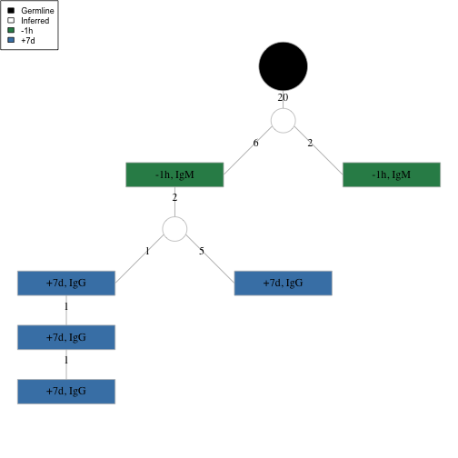
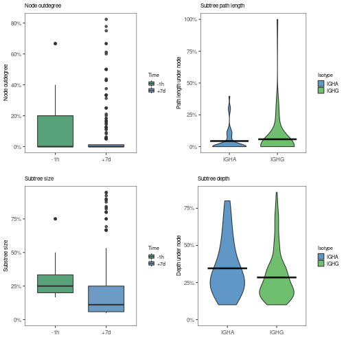
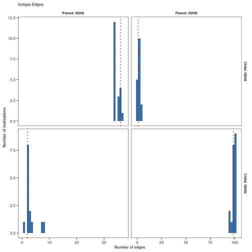
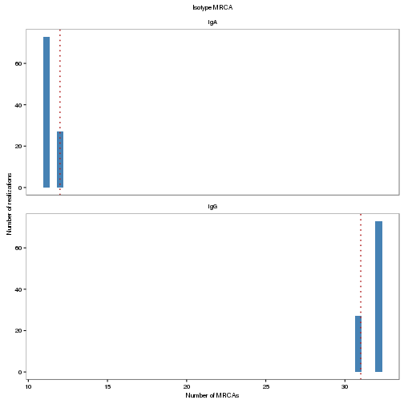

# Topology analysis

This vignette covers the basics of analyzing the topologies of Ig lineage 
trees built using `buildPhylipLineage`, using some built-in alakazam functions
that focus on quantifying annotation relationships within lineages.

## Example data

A small set of annotated example trees, `ExampleTrees`, are included in the `alakazam` package.
The trees are `igraph` objects with the following tree annotations (graph attributes):

* `clone`: An identifier for the clonal group. These entries correspond to the `clone_id`
           column in the `ExampleDb` data.frame from which the trees were generated.
* `v_gene`: IGHV gene name. 
* `j_gene`: IGHJ gene name. 
* `junc_len`: Length of the junction region (nucleotides).

And the following node annotations (vertex attributes):

* `sample_id`: Time point in relation to influenza vaccination.
* `c_call`: The isotype(s) assigned to the sequence. Multiple isotypes are 
            delimited by comma, and reflect identical V(D)J sequences observed
            with more than one isotype.
* `duplicate_count`: The copy number (duplicate count), which indicates the total number 
              of reads with the same V(D)J sequence.


```r
# Load required packages
library(alakazam)
library(igraph)
library(dplyr)

# Load example trees
data(ExampleTrees)

# Select one tree for example purposes
graph <- ExampleTrees[[24]]
# And add some annotation complexity to the tree
V(graph)$sample_id[c(2, 7)] <- "-1h"
V(graph)$c_call[c(2, 7)] <- "IGHM"

# Make a list of example trees excluding multi-isotype trees
graph_list <- ExampleTrees[sapply(ExampleTrees, function(x) !any(grepl(",", V(x)$c_call)))]
```

## Plotting annotations on a tree

There are many options for configuring how an igraph object is plotted which
are helpful for visualing annotation topologies. Below is an extensive example of
how to plot a tree by configuring the colors, labels, shapes and sizes of
different visual elements according to annotations embedded in the graph.


```r
# Set node colors
V(graph)$color[V(graph)$sample_id == "-1h"] <- "seagreen"
V(graph)$color[V(graph)$sample_id == "+7d"] <- "steelblue"
V(graph)$color[V(graph)$name == "Germline"] <- "black"
V(graph)$color[grepl("Inferred", V(graph)$name)] <- "white"

# Set node labels
V(graph)$label <- paste(V(graph)$sample_id, V(graph)$c_call, sep=", ")
V(graph)$label[V(graph)$name == "Germline"] <- ""
V(graph)$label[grepl("Inferred", V(graph)$name)] <- ""

# Set node shapes
V(graph)$shape <- "crectangle"
V(graph)$shape[V(graph)$name == "Germline"] <- "circle"
V(graph)$shape[grepl("Inferred", V(graph)$name)] <- "circle"

# Set node sizes
V(graph)$size <- 60
V(graph)$size[V(graph)$name == "Germline"] <- 30
V(graph)$size[grepl("Inferred", V(graph)$name)] <- 15 

# Remove large default margins
par(mar=c(0, 0, 0, 0) + 0.05)

# Plot the example tree
plot(graph, layout=layout_as_tree, vertex.frame.color="grey", 
     vertex.label.color="black", edge.label.color="black", 
     edge.arrow.mode=0)

# Add legend
legend("topleft", c("Germline", "Inferred", "-1h", "+7d"), 
       fill=c("black", "white", "seagreen", "steelblue"), cex=0.75)
```



## Summarizing node properties

Various annotation dependent node statistics can be calculated using the
`summarizeSubtrees` and `getPathLengths` functions. `getPathLengths` 
calculates distances from the root (germline) *to child nodes*, whereas 
`summarizeSubtrees` calculates paths and subtree statistics 
*from child nodes*.

### Calculating distance from the germline

To determine the shortest path from the germline sequence to any node, 
we use `getPathLengths`, which returns the distance both as the number
of "hops" (`steps`) and the number of mutational events (`distance`).


```r
# Consider all nodes
getPathLengths(graph, root="Germline")
```

```
##             name steps distance
## 1      Inferred1     1       20
## 2 GN5SHBT04CW57C     2       26
## 3      Inferred2     3       28
## 4 GN5SHBT08I7RKL     4       29
## 5 GN5SHBT04CAVIG     5       30
## 6       Germline     0        0
## 7 GN5SHBT01D6X0W     2       22
## 8 GN5SHBT06H7TQD     6       31
## 9 GN5SHBT05HEG2J     4       33
```

Note, the `STEPS` counted in the above example include traversal of inferred 
intermediates. If you want to exclude such nodes and consider only nodes
associated with observed sequences, you can specify an annotation field and 
value that will be excluded from the number of steps. In the example below
we are excluding `NA` values in the `c_call` annotation 
(`field="c_call", exclude=NA`). 


```r
# Exclude nodes without an isotype annotation from step count
getPathLengths(graph, root="Germline", field="c_call", exclude=NA)
```

```
##             name steps distance
## 1      Inferred1     0       20
## 2 GN5SHBT04CW57C     1       26
## 3      Inferred2     1       28
## 4 GN5SHBT08I7RKL     2       29
## 5 GN5SHBT04CAVIG     3       30
## 6       Germline     0        0
## 7 GN5SHBT01D6X0W     1       22
## 8 GN5SHBT06H7TQD     4       31
## 9 GN5SHBT05HEG2J     2       33
```

Note, `steps` has changed with respect to the previous example, but 
`distance` remains the same.

### Calculating subtree properties

The `summarizeSubtrees` function returns a table of each node with the 
following properties for each node:

* `name`: The node identifier.
* `parent`: The identifier of the node's parent.
* `outdegree`: The number of edges leading from the node.
* `size`: The total number of nodes within the subtree rooted at the node.
* `depth`: The depth of the subtree that is rooted at the node.
* `pathlength`: The maximum path length beneath the node.
* `outdegree_norm`: The `outdegree` normalized by the total number of edges.
* `size_norm`: The `size` normalized by the total tree size.
* `depth_norm`: The `depth` normalized by the total tree depth.
* `pathlength_norm`: The `pathlength` normalized by the longest path.

The `fields=c("sample_id", "c_call")` argument in the example below simply
defines which annotations we wish to retain in the output. This argument
has no effect on the results, in constast to the behavior of `getPathLengths`.


```r
# Summarize tree
df <- summarizeSubtrees(graph, fields=c("sample_id", "c_call"), root="Germline")
print(df[1:4])
```

```
##             name sample_id c_call         parent
## 1      Inferred1      <NA>   <NA>       Germline
## 2 GN5SHBT04CW57C       -1h   IGHM      Inferred1
## 3      Inferred2      <NA>   <NA> GN5SHBT04CW57C
## 4 GN5SHBT08I7RKL       +7d   IGHG      Inferred2
## 5 GN5SHBT04CAVIG       +7d   IGHG GN5SHBT08I7RKL
## 6       Germline      <NA>   <NA>           <NA>
## 7 GN5SHBT01D6X0W       -1h   IGHM      Inferred1
## 8 GN5SHBT06H7TQD       +7d   IGHG GN5SHBT04CAVIG
## 9 GN5SHBT05HEG2J       +7d   IGHG      Inferred2
```

```r
print(df[c(1, 5:8)])
```

```
##             name outdegree size depth pathlength
## 1      Inferred1         2    8     6         13
## 2 GN5SHBT04CW57C         1    6     5          7
## 3      Inferred2         2    5     4          5
## 4 GN5SHBT08I7RKL         1    3     3          2
## 5 GN5SHBT04CAVIG         1    2     2          1
## 6       Germline         1    9     7         33
## 7 GN5SHBT01D6X0W         0    1     1          0
## 8 GN5SHBT06H7TQD         0    1     1          0
## 9 GN5SHBT05HEG2J         0    1     1          0
```

```r
print(df[c(1, 9:12)])
```

```
##             name outdegree_norm size_norm depth_norm pathlength_norm
## 1      Inferred1          0.250 0.8888889  0.8571429      0.39393939
## 2 GN5SHBT04CW57C          0.125 0.6666667  0.7142857      0.21212121
## 3      Inferred2          0.250 0.5555556  0.5714286      0.15151515
## 4 GN5SHBT08I7RKL          0.125 0.3333333  0.4285714      0.06060606
## 5 GN5SHBT04CAVIG          0.125 0.2222222  0.2857143      0.03030303
## 6       Germline          0.125 1.0000000  1.0000000      1.00000000
## 7 GN5SHBT01D6X0W          0.000 0.1111111  0.1428571      0.00000000
## 8 GN5SHBT06H7TQD          0.000 0.1111111  0.1428571      0.00000000
## 9 GN5SHBT05HEG2J          0.000 0.1111111  0.1428571      0.00000000
```

Distributions of normalized subtree statistics for a population of trees 
can be plotted using the `plotSubtrees` function. In the example below,
we have specified `silent=TRUE` which causes `plotSubtrees` to return the 
ggplot object without rendering the plot. The ggplot object are then
plotting using the `gridPlot` function which places each individual plot in
a separate panel of the same figure.


```r
# Set sample colors
sample_colors <- c("-1h"="seagreen", "+7d"="steelblue")

# Box plots of node outdegree by sample
p1 <- plotSubtrees(graph_list, "sample_id", "outdegree", colors=sample_colors, 
                   main_title="Node outdegree", legend_title="Time", 
                   style="box", silent=TRUE)
# Box plots of subtree size by sample
p2 <- plotSubtrees(graph_list, "sample_id", "size", colors=sample_colors, 
                   main_title="Subtree size", legend_title="Time", 
                   style="box", silent=TRUE)
# Violin plots of subtree path length by isotype
p3 <- plotSubtrees(graph_list, "c_call", "pathlength", colors=IG_COLORS, 
                   main_title="Subtree path length", legend_title="Isotype", 
                   style="violin", silent=TRUE)
```

```
## Warning: Ignoring unknown parameters: fun.y
```

```r
# Violin plots of subtree depth by isotype
p4 <- plotSubtrees(graph_list,  "c_call", "depth", colors=IG_COLORS, 
                   main_title="Subtree depth", legend_title="Isotype", 
                   style="violin", silent=TRUE)
```

```
## Warning: Ignoring unknown parameters: fun.y
```

```r
# Plot in a 2x2 grid
gridPlot(p1, p2, p3, p4, ncol=2)
```

```
## No summary function supplied, defaulting to `mean_se()`
## No summary function supplied, defaulting to `mean_se()`
```



## Counting and testing node annotation relationships

Given a set of annotated trees, you can determine the abundance of specific parent-child 
relationships within individual trees using the `tableEdges` function and the
signficance of these relationships in population of trees using the `testEdges` 
function. Annotation relationships over edges can be calculated as direct or indirect relationships, where a direct relationship is a parent-child pair and an indirect 
relationship is a decent relationship that travels through another node (or nodes) first. 

### Tabulating edges for a single tree

Tabulating all directparent-child annotation relationships in the tree by isotype 
annotation can be performed like so:


```r
# Count direct edges between isotypes
tableEdges(graph, "c_call")
```

```
## # A tibble: 5 x 3
## # Groups:   parent [3]
##   parent child count
##   <chr>  <chr> <int>
## 1 IGHG   IGHG      2
## 2 IGHM   <NA>      1
## 3 <NA>   IGHG      2
## 4 <NA>   IGHM      2
## 5 <NA>   <NA>      1
```

The above output is cluttered with the `NA` annotations from the germline and 
inferred nodes. We can perform the same direct tabulation, but exclude any nodes 
annotated with either `Germline` or `NA` for c_call using the `exclude` argument:


```r
# Direct edges excluding germline and inferred nodes
tableEdges(graph, "c_call", exclude=c("Germline", NA))
```

```
## # A tibble: 1 x 3
## # Groups:   parent [1]
##   parent child count
##   <chr>  <chr> <int>
## 1 IGHG   IGHG      2
```

As there are inferred nodes in the tree, we might want to consider indirect
parent-child relationships that traverse through inferred nodes. This is accomplished
using the same arguments as above, but with the addition of the `indirect=TRUE` argument
which will skip over the excluded nodes when tabulating annotation pairs:


```r
# Count indirect edges walking through germline and inferred nodes
tableEdges(graph, "c_call", indirect=TRUE, exclude=c("Germline", NA))
```

```
## # A tibble: 2 x 3
## # Groups:   parent [2]
##   parent child count
##   <chr>  <chr> <int>
## 1 IGHG   IGHG      2
## 2 IGHM   IGHG      2
```

### Significance testing of edges in a population of trees

Given a population of trees, as a list of annotated igraph objects, you
can determine if there is enrichment for specific annotation pairs using the
`testEdges` function. This has the same options as `tableEdges`, except that
the values `c("Germline", NA)` are excluded by default. `testEdges` performs a
permutation test to generated a null distribution, excluding permutation of
of any annotations specified to the `exclude` argument (these annotation remain
fix in the tree). P-values output by `testEdges` are one-sided tests that the
annotation pair is observed more often than expected.


```r
# Test isotype relationships
edge_test <- testEdges(graph_list, "c_call", nperm=20)

# Print p-value table
print(edge_test)
```

```
##   parent child count  expected    pvalue
## 1   IGHA  IGHA    36 34.650000 0.0000000
## 2   IGHA  IGHG     2  2.789474 0.6842105
## 3   IGHG  IGHA     1  2.421053 0.7894737
## 4   IGHG  IGHG    99 98.400000 0.3000000
```

```r
# Plot null distributions for each annotation pair
plotEdgeTest(edge_test, color="steelblue", main_title="Isotype Edges", 
             style="hist")
```



## Counting and testing MRCA annotations

The most recent common ancestor (MRCA) of an Ig lineage we define herein
as the most ancestral observed (or inferred) sequences in the lineage tree. 
Meaning, the node that is most proximal (by some measure) to the germline/root 
node. The `getMRCA` and `testMRCA` functions provide extraction and significance
testing of MRCA sequences by annotation value, respectively.

### Extracting MRCAs from a tree

Extracting the MRCA from a tree is accomplished using the `getMRCA` function.
The germline distance criteria are as described above for `getPathLengths`
and can be either node hops or mutational events, with or without exclusion
of nodes with specific annotations. To simply extract the annotations for the 
node(s) immediately below the germline, you can use the `path=steps` argument 
without any node exclusion:


```r
# Use unweighted path length and do not exclude any nodes
mrca_df <- getMRCA(graph, path="steps", root="Germline")

# Print subset of the annotation data.frame
print(mrca_df[c("name", "sample_id", "c_call", "steps", "distance")])
```

```
##                name sample_id c_call steps distance
## Inferred1 Inferred1      <NA>   <NA>     1       20
```

To use mutational distance and consider only observed (ie, non-germline and 
non-inferred) nodes, we specify the exclusion field (`field="c_call"`) and
exclusion value within that field (`exclude=NA`):


```r
# Exclude nodes without an isotype annotation and use weighted path length
mrca_df <- getMRCA(graph, path="distance", root="Germline", 
                   field="c_call", exclude=NA)

# Print excluding sequence, label, color, shape and size annotations
print(mrca_df[c("name", "sample_id", "c_call", "steps", "distance")])
```

```
##                          name sample_id c_call steps distance
## GN5SHBT01D6X0W GN5SHBT01D6X0W       -1h   IGHM     1       22
```

### Significance testing of MRCA annotations

Similar to `testEdges`, the function `testMRCA` will perform a permutation
test to determine the significance of an annotation appearing at the MRCA 
over a population of trees. P-values output by `testMRCA` are one-sided tests 
that the annotation is observed more often than expected in the MRCA position.


```r
# Test isotype MRCA annotations
mrca_test <- testMRCA(graph_list, "c_call", nperm=20)
```

```r
# Print p-value table
print(mrca_test)
```

```
##   annotation count expected pvalue
## 1       IGHA    12    11.35   0.00
## 2       IGHG    31    31.65   0.65
```

```r
# Plot null distributions for each annotation
plotMRCATest(mrca_test, color="steelblue", main_title="Isotype MRCA", 
             style="hist")
```


